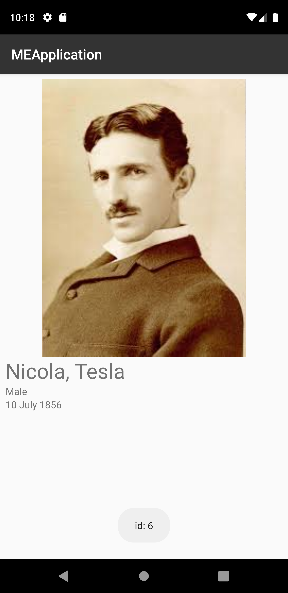

# me-challenge

A simple demonstration for querying a list of employee and displaying a detailed view. This is mostly a demonstration of core functionality and architecture so the scope of features is limited.

Employee List                       |  Employee Details
:--------------------------------:|:-------------------------:
   |  

## Functionality

- Display a list of employees
- Display details of a selected employee

## Architecture

The demo app is implemented using a combination of clean architecture and an MVVM presentation layer in Kotlin.

### Clean Architecture

The clean architecture allows for a good separation of concerns between querying and storing data, processing of data, and presenting data into 3 distinct layers. Known as the data, domain, and presentation layers, each layer only communicates directly with one other. This helps to prevent changes in the data layer from affecting the presentation layer and vice versa. 

### Data Layer

The Data Layer of the application is responsible for data access and storage with local and remote resources. By design, the data layer contains all logic responsible for querying and saving data within the app. The data layer provides functionality to the domain layer through the use of data repositories. Each repository provides generic access to a data source while abstracting away the implementation details.

### Domain Layer

The Domain layer of the app serves as the intermediary between the data and the presentation layer. It is responsible for interaction with the data layer and providing information to the presentation layer through the use of use cases. These Use Cases are small reusable pieces of business logic that can be used by themselves, or through composition, to provide greater functionality to the app.

### Presentation Layer & MVVM

The presentation layer contains the logic required for navigation and displaying data throughout the app. Each Fragment has an accompanying ViewModel that interacts with the domain layer to retrieve data for display. Once retrieved, the data is then presented to the view which can then place the data in the relevant layout. This allows for a separation between the querying of data and the layout of the data within the app. Events raised in the view are passed to the ViewModel to update the backing data.

## Dependency

### Language

- Kotlin

### Architecture

- Lifecycle
- LiveData
- Databinding
- Koin

### View

- ConstraitLayout
- RecyclerView
- CardView
- Glide

### Network

- Retrofit

## Assumptions & Notes

- Retry feature is not required
- Network is always available
- UI Design is optimized for phones
- Local cache / database is not required
